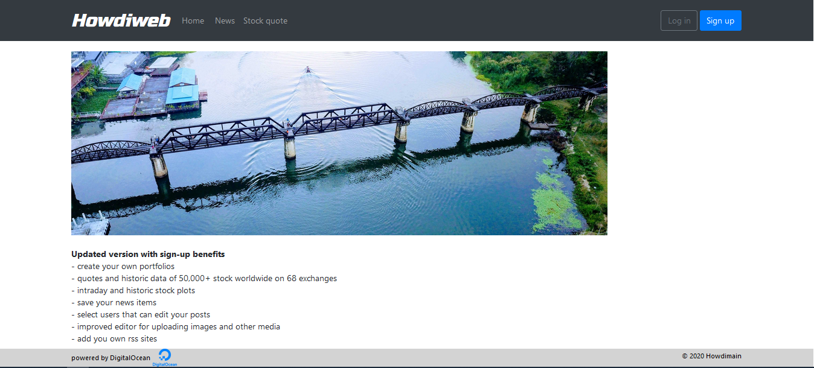

# Howdiweb
>Website application with topic board and personal news feeds
>
>The website is available at: https://www.howdiweb.nl  
>
>

## Framworks used
- Python 3.6.8
- Django 2.2.3
- Database PostgreSQL
- Email Imgur
- Markdown editor Martor
- RSS feed through Feedparser
- Instance is running on Digital Ocean at ip `174.138.5.244`
- Requirements are listed in `requirements.txt`:

## Environment variables
Environment variables are give in the file `.env` and for obvious reasons not provided.   
Following settings must be given:
```
SECRET_KEY =
LOG_FILE =
DEBUG =
ALLOWED_HOSTS =
 
# postgresql database on localhost
DB_NAME =
DB_USER =
DB_PASSWORD =

# imgur client_id and key
IMGUR_CLIENT_ID =
IMGUR_SECRET_KEY =
 
# email mailgun
EMAIL_BACKEND = django.core.mail.backends.smtp.EmailBackend
EMAIL_HOST = 
EMAIL_HOST_USER =
EMAIL_HOST_PASSWORD =
```
To work with `.env` add the following to Django `settings.py`:
```
from decouple import config, Csv
...
SECRET_KEY = config('SECRET_KEY')
DEBUG = config('DEBUG', default=False, cast=bool)
ALLOWED_HOSTS = config('ALLOWED_HOSTS', cast=Csv())
etc
```

## Author
Name: Bruno Vermeulen  
For any question please contact me at bruno.vermeulen@hotmail.com  
Last update: 7 July 2019  
